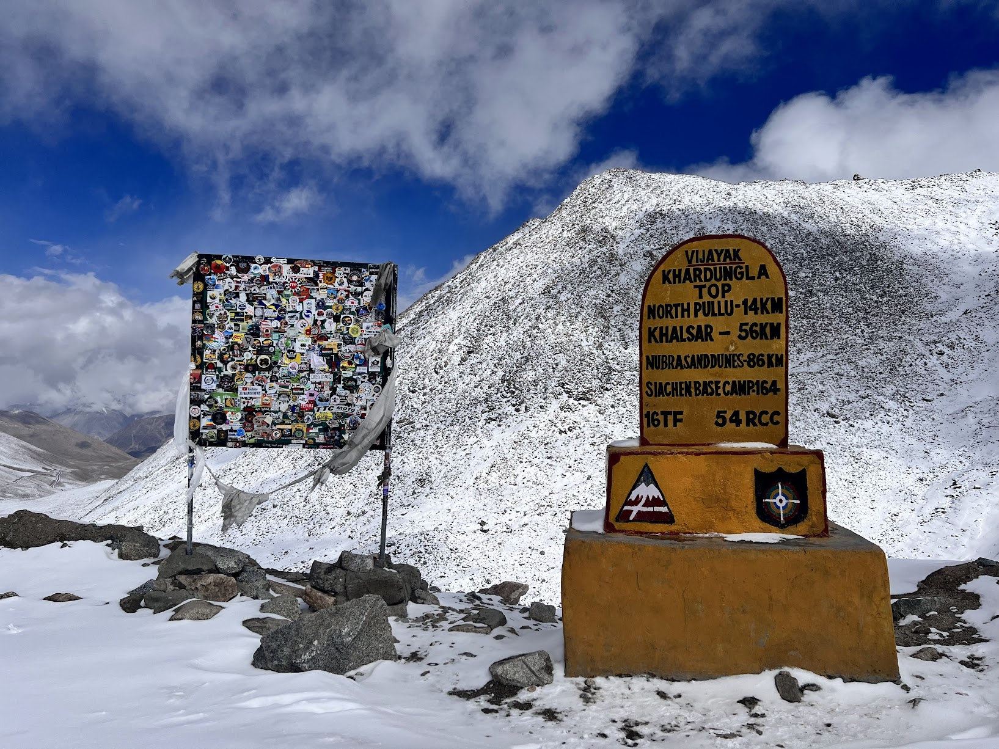
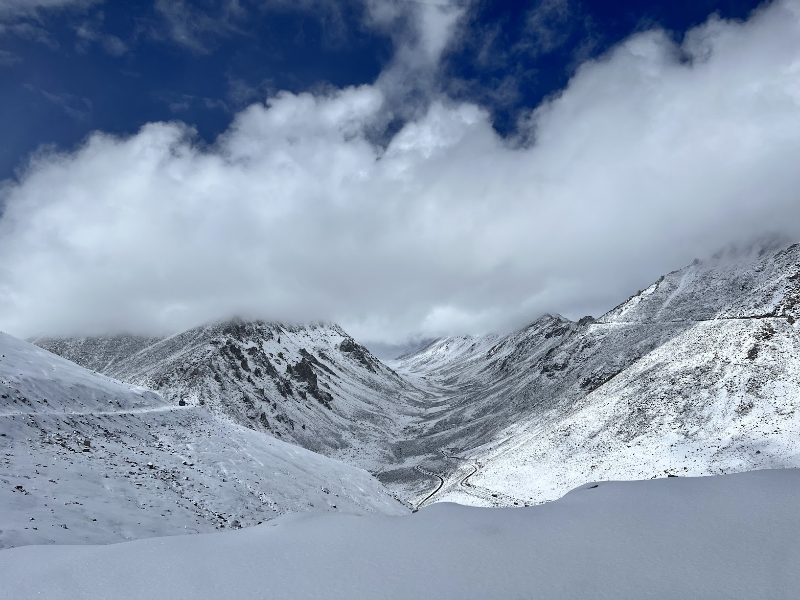
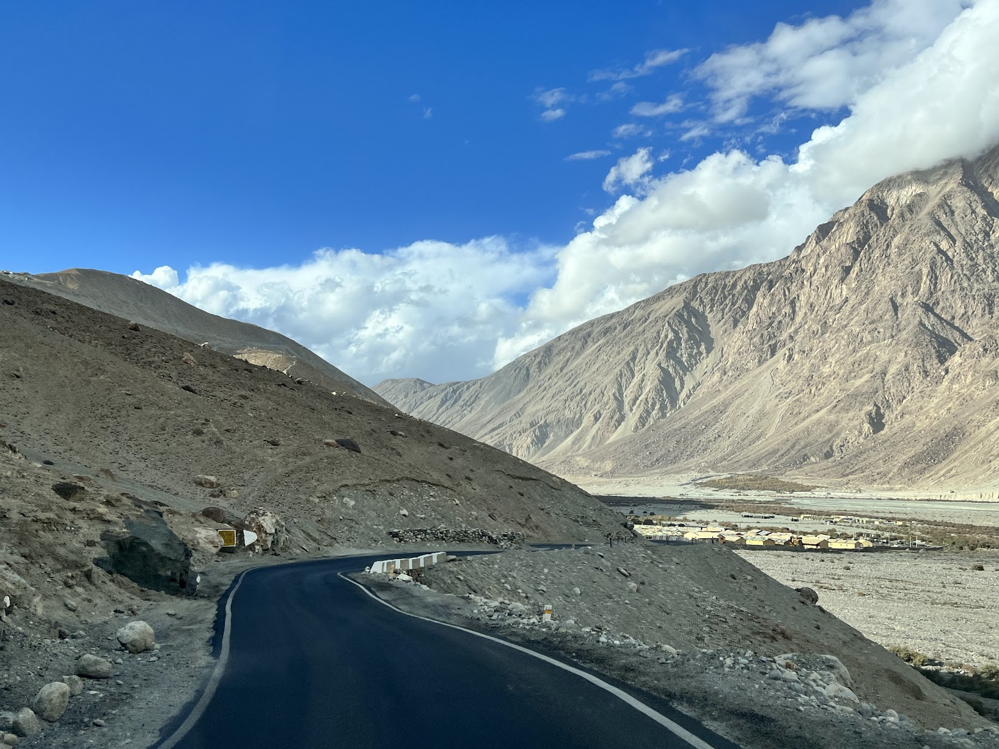

# Photography kit

Use these photographs for three experiments: storytelling, detailed description, and image recreation. Photography by Pavan, supplied from his own photographs for Swatch. These are the supplied PNG copies; camera originals, capture dates, and metadata have not been verified. No reuse license is implied.

## The photographs

Attach the downloaded files to the model. Page previews, captions, and reviewer guides are for the person running the experiment; do not include them in the model input. Preserve the same files and attachment order across comparable runs.

### Photo 01

[Download Photo 01 (PNG)](assets/photography/photo-01.png)

### Photo 02

[Download Photo 02 (PNG)](assets/photography/photo-02.png)

### Photo 03

[Download Photo 03 (PNG)](assets/photography/photo-03.png)

## Choose an experiment

| Experiment | Attach | What it tests |
| --- | --- | --- |
| [Write a story from three photos](experiments/write-a-story-from-three-photos.md) | Photos 01, 02, 03, in that order | Narrative continuity and visual grounding |
| [Describe a detailed image](experiments/describe-a-detailed-image.md) | Photo 01 | Detail, text recognition, spatial relationships, uncertainty |
| [Recreate an image](experiments/recreate-an-image.md) | Photo 02 | Translation into language and preservation of composition |

These photographs share a mountain-road setting. This story exercise tests how well a model develops a connected journey; it does not test bridging unrelated subject matter. Their actual chronological order and the relationship between their locations are not established by the images.

## Run a small comparison

1. Choose two models and run each experiment twice per model, in fresh chats. This produces twelve runs across the three experiments; it is an exploratory comparison, not a statistical ranking.
2. Use the same files, attachment order, exact prompt, and available tools. For story and description runs, turn off browsing where possible so the model works from the images. Record any differences you cannot control.
3. Save the complete first response and any generated files before reviewing. Keep failures and incomplete attempts. Record follow-ups separately rather than replacing the original output.
4. Use the [run template](run-template.md) and the experiment's reviewer guide. Keep the guide out of the model's conversation.
5. Put comparable outputs beside one another. Note specific evidence, recurring strengths, failures, and variation between attempts. Where practical, review outputs under anonymous run IDs before revealing model names.

For recreation, record both the describing model and the image generator. Compare description-only generation separately from generation that also receives the reference image. If the generator differs, conclusions concern the combined workflow rather than the describing model alone.

## Context policy

The default runs use only the photographs and prompt. Do not add trip memories, inferred locations, dates, or a proposed story sequence. A later run may include photographer-provided context, but save that context verbatim and compare it only with similarly informed runs.

## Reviewer guides

- [Story guide](reviewer-guides/story.md)
- [Description guide](reviewer-guides/description.md)
- [Recreation guide](reviewer-guides/recreation.md)
